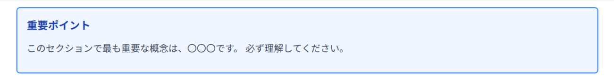
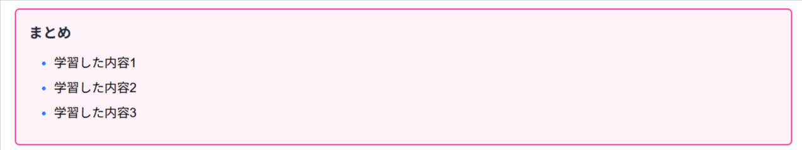

# マークダウン書式ガイド

学習コンテンツ作成時のマークダウン記法について説明します。このガイドに従って、コンテンツを作成してください。

---

## 目次

1. [基本的なマークダウン要素](#基本的なマークダウン要素)
2. [カスタムブロック](#カスタムブロック)
3. [記載例](#記載例)

---

## 基本的なマークダウン要素

### 見出し

```markdown
# 見出し1（ページタイトル）
## 見出し2（セクション）
### 見出し3（サブセクション）
#### 見出し4
##### 見出し5
###### 見出し6
```

### テキスト装飾

```markdown
**太字**
*イタリック*
***太字イタリック***
~~打ち消し線~~
`インラインコード`
```

### リスト

**箇条書き：**
```markdown
- 項目1
- 項目2
  - ネストされた項目2-1
  - ネストされた項目2-2
- 項目3
```

**番号付きリスト：**
```markdown
1. 最初の項目
2. 2番目の項目
3. 3番目の項目
```

### コードブロック

```markdown
\`\`\`javascript
const greeting = "Hello, World!";
console.log(greeting);
\`\`\`
```

言語を指定することで、シンタックスハイライトが適用されます。

### 引用

```markdown
> これは引用です
> 複数行の引用も可能です
```

### 表

```markdown
| 列1 | 列2 | 列3 |
|-----|-----|-----|
| セル1 | セル2 | セル3 |
| セル4 | セル5 | セル6 |
```

### リンク

```markdown
[リンクテキスト](https://example.com)
```

### 画像

```markdown

```

### 水平線

```markdown
---
```

---

## カスタムブロック

このシステムでは、独自のカスタムブロック記法を使用します。以下の形式で記載してください。

### 記法

```markdown
:::block-name
ブロック内のコンテンツ
:::
```

このマークダウンは、以下のHTMLに変換されます：

```html
<div class="block-name">ブロック内のコンテンツ</div>
```

### 利用可能なブロックタイプ

| ブロック名 | 用途 | 説明 |
|-----------|------|------|
| `sample-quiz` | サンプル問題 | 練習問題の例を表示します（紫色） |
| `exercise` | 練習問題 | 問題をときながら理解を深める練習問題です（青色） |
| `practice` | 発展問題 | これまでの学習をもとに飛躍させる問題です（赤色） |
| `point` | 重要ポイント | 重要な情報を強調表示します（青色） |
| `hint` | ヒント | 問題解答のヒントを提供します（シアン色） |
| `warning` | 注意 | 注意すべき情報を表示します（琥珀色） |
| `summary` | まとめ | セクションの要点をまとめます（ピンク色） |
| `message` | メッセージ | 一般的な情報メッセージです（グレー色） |
| `center` | 中央配置 | 内容を中央に配置します |

### カスタムブロックの使用例


**サンプル問題：**


```markdown
:::sample-quiz
### サンプル問題
問題：以下の式を計算してください。
2 + 2 = ?

答え：4
:::
```
**練習問題：**


```markdown
:::exercise
### 練習問題
問題：以下の式を計算してください。

2 + 2 + 2 + 2 = ? 

答え：8
:::
```

**発展問題：**


```markdown
:::practice
### 発展問題
問題：以下の式を計算してください。

2 * 2 * 2 * 2 = ?

答え：16
:::
```

**重要ポイント：**



```markdown
:::point
### 重要ポイント
このセクションで最も重要な概念は、〇〇〇です。
必ず理解してください。
:::
```

**ヒント：**


```markdown
:::hint
### ヒント
わからない場合は、基本的な定義に戻って考えてみましょう。
:::
```

**注意：**


```markdown
:::warning
### 注意
この方法は古い仕様です。新しい方法を使用してください。
:::
```

**まとめ：**



```markdown
:::summary
### まとめ
- 学習した内容1
- 学習した内容2
- 学習した内容3
:::
```

**メッセージ：**


```markdown
:::message
### メッセージ
このセクションで最も重要な概念は、〇〇〇です。
必ず理解してください。
:::
```

**中央配置：**


```markdown
:::center
### 中央配置
中央配置がしたくなる場合はこちらです。
:::
```

---

## 記載例

以下は、上記の要素を組み合わせた記載例です。

```markdown
# JavaScriptの基礎

## 変数について

JavaScriptでは、`const`、`let`、`var`の3つのキーワードで変数を宣言できます。

:::point
現代のJavaScriptでは、`const`と`let`を使用することが推奨されています。
`var`は古い仕様です。
:::

### 変数宣言の方法

1. **const**：再代入不可の定数
2. **let**：ブロックスコープの変数
3. **var**：関数スコープの変数（非推奨）

### コード例

\`\`\`javascript
const name = "太郎";
let age = 25;
var city = "東京";
\`\`\`

:::sample-quiz
問題：以下のコードで、`name`の値を変更することはできますか？

\`\`\`javascript
const name = "太郎";
name = "花子";
\`\`\`

答え：いいえ、`const`で宣言された変数は再代入できません。
エラーが発生します。
:::

:::hint
`const`と`let`の違いについて、詳しくは公式ドキュメントを参照してください。
:::

:::warning
`var`を使用すると、予期しない動作が発生する可能性があります。
新しいコードでは使用しないでください。
:::

:::summary
- `const`は再代入不可の定数
- `let`はブロックスコープの変数
:::
```

---

## 作成時の注意点

- **一貫性**：同じタイプの情報には、同じブロックタイプを使用してください
- **階層構造**：見出しの階層を適切に保ってください（`#`→`##`→`###`の順序）
- **改行**：ブロック前後には空行を入れてください
- **コード**：プログラミングコードは必ずコードブロックで囲んでください
- **画像**：画像を使用する場合は、代替テキストを必ず記載してください

---

**このガイドに従ってコンテンツを作成してください。ご不明な点があれば、お問い合わせください。**
